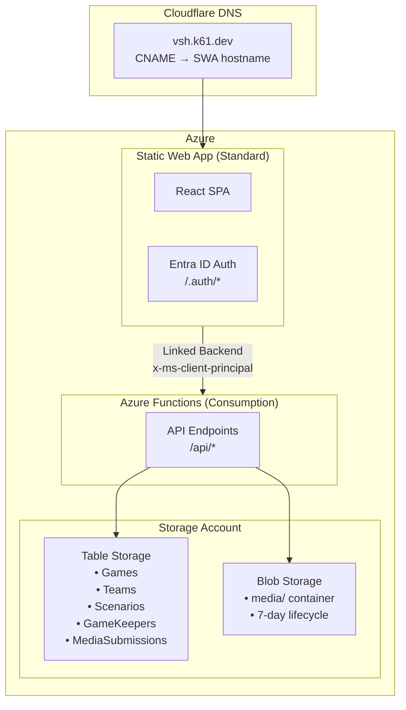

# Deployment Guide

This guide covers deploying the Video Scavenger Hunt app to Azure.

## Production Environment

| Resource | Name | Region | Notes |
|----------|------|--------|-------|
| Resource Group | `rg-vsh-prod` | westus2 | Contains all resources |
| Static Web App | `swa-vsh-prod` | eastus2 | Standard tier (~$9/month) |
| Function App | `func-vsh-prod` | westus2 | Consumption plan (Y1) |
| Storage Account | `stvsh*` | westus2 | Standard_LRS |
| Custom Domain | vsh.k61.dev | - | DNS via Cloudflare |

## Architecture



**Key Architecture Decisions:**
- **SWA Standard Tier** - Required for linked backends (proxies /api/* to Function App)
- **Standalone Function App** - Consumption plan for cost efficiency
- **Linked Backend** - SWA automatically forwards auth headers to Function App
- **No CORS** - All traffic flows through SWA (same origin)
- **Proxied Uploads** - Media uploads go through Function App (not direct to blob)

---

## Prerequisites

- Azure subscription with Contributor access
- Azure CLI installed (`az --version`)
- GitHub repository access (for CI/CD)
- Cloudflare account (for DNS)

---

## Step 1: Create Entra ID App Registration

This enables "Sign in with Microsoft" for game keepers.

### In Azure Portal

1. Go to **Microsoft Entra ID** → **App registrations** → **New registration**

2. Configure the app:
   - **Name**: `Video Scavenger Hunt`
   - **Supported account types**: `Accounts in any organizational directory and personal Microsoft accounts`
   - **Redirect URI**: Leave blank for now

3. Click **Register** and note:
   - **Application (client) ID** → `AZURE_CLIENT_ID`
   - **Directory (tenant) ID** → For reference

4. Go to **Certificates & secrets** → **Client secrets** → **New client secret**
   - **Description**: `SWA Auth`
   - **Expires**: 24 months
   - **Copy the secret value immediately** → `AZURE_CLIENT_SECRET`

5. Go to **Authentication** → **Add a platform** → **Web**
   - Add redirect URIs:
     - `https://vsh.k61.dev/.auth/login/aad/callback`
     - `https://<swa-hostname>.azurestaticapps.net/.auth/login/aad/callback`
   - Check **ID tokens** under Implicit grant

6. Go to **API permissions**
   - Ensure `Microsoft Graph > User.Read` is present

---

## Step 2: Configure GitHub Secrets

Add these secrets to your GitHub repository (**Settings → Secrets → Actions**):

| Secret Name | Description |
|-------------|-------------|
| `AZURE_CREDENTIALS` | Azure service principal JSON (see below) |
| `AZURE_CLIENT_ID` | Entra ID app client ID |
| `AZURE_CLIENT_SECRET` | Entra ID app client secret |

### Create Azure Service Principal

```bash
# Create resource group first
az group create --name rg-vsh-prod --location westus2

# Create service principal with Contributor access
az ad sp create-for-rbac \
  --name "github-vsh-deploy" \
  --role contributor \
  --scopes /subscriptions/<subscription-id>/resourceGroups/rg-vsh-prod \
  --sdk-auth
```

Copy the entire JSON output as the `AZURE_CREDENTIALS` secret.

---

## Step 3: Deploy via GitHub Actions

Push to `main` branch to trigger the deployment workflow.

The workflow (`.github/workflows/deploy.yml`) automatically:
1. Validates code (lint + build)
2. Creates resource group (if needed)
3. Deploys Bicep infrastructure
4. Configures Function App settings
5. Links Function App as SWA backend
6. Deploys Functions code
7. Deploys SWA frontend

### First-Time Deployment

After the first deployment, you need to:

1. **Add the SWA hostname to Entra ID redirect URIs** (Step 1.5)
2. **Configure custom domain** (Step 4)
3. **Seed initial data** (Step 5)

---

## Step 4: Configure Custom Domain (Cloudflare)

### Get Azure Validation Info

1. In Azure Portal, go to your Static Web App
2. Go to **Custom domains** → **Add**
3. Enter: `vsh.k61.dev`
4. Note the validation requirements

### In Cloudflare

1. Add CNAME record:
   ```
   Type: CNAME
   Name: vsh
   Target: <swa-hostname>.azurestaticapps.net
   Proxy status: DNS only (gray cloud) ← IMPORTANT!
   ```

2. If Azure requires TXT validation:
   ```
   Type: TXT
   Name: _dnsauth.vsh
   Content: <validation-token-from-azure>
   ```

**Important:** Cloudflare proxy must be OFF (gray cloud). Azure SWA provides its own SSL certificate, and Cloudflare proxy will cause conflicts.

### Verify Domain

1. Return to Azure Portal → Static Web App → Custom domains
2. Click **Validate** (may take a few minutes for DNS propagation)
3. Azure automatically provisions an SSL certificate

---

## Step 5: Seed Initial Data

After deployment, seed the scenario library and first game keeper:

```bash
# Seed scenarios (23 scenarios across 3 categories)
curl -X POST https://vsh.k61.dev/api/scenarios/seed

# Add first game keeper
curl -X POST https://vsh.k61.dev/api/gamekeepers/seed
```

The seed endpoints are idempotent - running them multiple times won't create duplicates.

---

## Troubleshooting

### Authentication Not Working

1. Verify redirect URIs in Entra ID include both:
   - `https://vsh.k61.dev/.auth/login/aad/callback`
   - `https://<swa-hostname>.azurestaticapps.net/.auth/login/aad/callback`

2. Check Function App settings:
   ```bash
   az functionapp config appsettings list \
     --name func-vsh-prod \
     --resource-group rg-vsh-prod \
     --query "[?name=='AZURE_CLIENT_ID' || name=='AZURE_CLIENT_SECRET']"
   ```

### API Returns 401/403

1. Check that Function App is linked as SWA backend:
   ```bash
   az staticwebapp backends show \
     --name swa-vsh-prod \
     --resource-group rg-vsh-prod
   ```

2. Verify the `x-ms-client-principal` header is being forwarded (check Function App logs)

### Custom Domain Validation Fails

1. Ensure Cloudflare proxy is OFF (gray cloud)
2. Wait 5-10 minutes for DNS propagation
3. Verify with: `nslookup vsh.k61.dev`
4. Try removing and re-adding the custom domain in Azure

### Blobs Not Auto-Deleting

The lifecycle policy runs once per day. Allow 24-48 hours for cleanup to occur.

### Deployment Fails

1. Check GitHub Actions logs for specific errors
2. Verify all secrets are set correctly
3. Ensure service principal has Contributor access to the resource group

---

## Manual Operations

### Upgrade SWA to Standard Tier

If the Bicep deployment doesn't automatically upgrade:

```bash
az staticwebapp update \
  --name swa-vsh-prod \
  --resource-group rg-vsh-prod \
  --sku Standard
```

### Link Function App as Backend

If the workflow step fails:

```bash
SUBSCRIPTION_ID=$(az account show --query id -o tsv)
FUNC_RESOURCE_ID="/subscriptions/$SUBSCRIPTION_ID/resourceGroups/rg-vsh-prod/providers/Microsoft.Web/sites/func-vsh-prod"

az staticwebapp backends link \
  --name swa-vsh-prod \
  --resource-group rg-vsh-prod \
  --backend-resource-id "$FUNC_RESOURCE_ID" \
  --backend-region westus2
```

### Reset All Data

To clear all game data and re-seed:

```bash
# Redeploy with resetData=true
az deployment group create \
  --resource-group rg-vsh-prod \
  --template-file infra/main.bicep \
  --parameters environment=prod customDomain=vsh.k61.dev resetData=true

# Re-seed data
curl -X POST https://vsh.k61.dev/api/scenarios/seed
curl -X POST https://vsh.k61.dev/api/gamekeepers/seed
```

---

## Cost Summary

| Resource | Monthly Cost |
|----------|--------------|
| Static Web Apps (Standard) | ~$9.00 |
| Functions (Consumption) | < $0.01 |
| Storage (Tables + Blobs) | ~$0.05-0.25 |
| **Total** | **~$9-10/month** |

---

## Security Checklist

- [x] Blob public access disabled
- [x] Storage uses connection string (only accessible to Function App)
- [x] Entra ID for game keeper authentication
- [x] HTTPS enforced via Azure SWA
- [x] Auth headers forwarded via linked backend
- [x] No CORS configuration needed (same-origin via SWA proxy)
- [x] Media uploads validated server-side before storage
