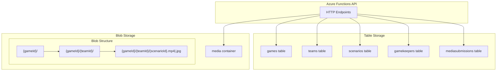
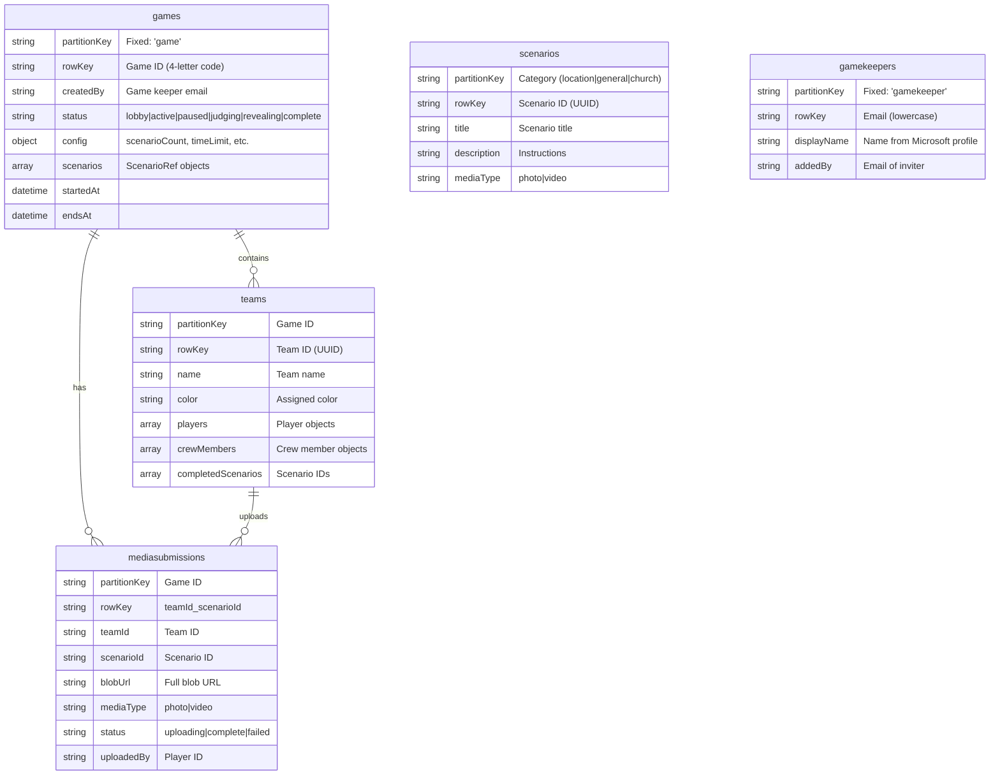
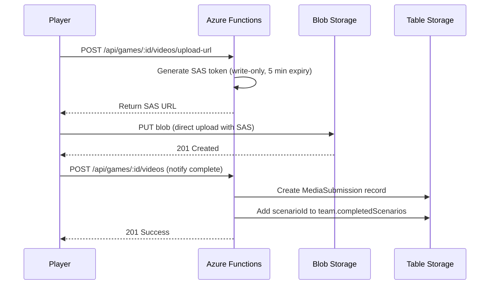

# Storage Architecture

This document describes how Azure Storage is used in the Video Scavenger Hunt application.

## Overview

The application uses two types of Azure Storage:
- **Azure Table Storage** - NoSQL key-value store for game state, teams, scenarios, and metadata
- **Azure Blob Storage** - Object storage for photos and videos uploaded by players



---

## Table Storage

Table Storage uses a partition key + row key model for efficient querying. All tables are auto-created on application startup.

### Tables

| Table Name | Purpose |
|------------|---------|
| `games` | Game sessions with config, status, and timing |
| `teams` | Teams within each game |
| `scenarios` | Library of reusable scenarios |
| `gamekeepers` | Authorized game keeper email allowlist |
| `mediasubmissions` | Metadata for uploaded photos/videos |

### Partition Strategies



### Query Patterns

| Query | Implementation |
|-------|----------------|
| Get game by code | `games` table: partitionKey='game', rowKey='{gameCode}' |
| Get all teams for a game | `teams` table: partitionKey='{gameId}' |
| Get all scenarios | `scenarios` table: list all entities |
| Get scenarios by category | `scenarios` table: partitionKey='{category}' |
| Check if email is game keeper | `gamekeepers` table: partitionKey='gamekeeper', rowKey='{email}' |
| Get media for a game | `mediasubmissions` table: partitionKey='{gameId}' |
| Get specific submission | `mediasubmissions` table: partitionKey='{gameId}', rowKey='{teamId}_{scenarioId}' |

---

## Blob Storage

Blob Storage holds all uploaded photos and videos. A single container named `media` is used.

### Container Structure

```
media/
├── {gameId}/
│   ├── {teamId}/
│   │   ├── {scenarioId}.jpg    # Photo submissions
│   │   ├── {scenarioId}.mp4    # Video submissions (or .webm)
│   │   └── ...
│   └── {anotherTeamId}/
│       └── ...
└── {anotherGameId}/
    └── ...
```

### Upload Flow



### SAS Token Security

| Token Type | Purpose | Permissions | Expiry |
|------------|---------|-------------|--------|
| Upload | Player uploads media | Write only | 5 minutes |
| Download | View media in judging/gallery | Read only | 1 hour |

### CORS Configuration

Blob Storage CORS is configured programmatically on startup:

```typescript
{
  allowedOrigins: '*',  // Dev: all origins; Prod: restrict to domain
  allowedMethods: 'GET,HEAD,PUT,POST,DELETE,OPTIONS',
  allowedHeaders: '*',
  exposedHeaders: '*',
  maxAgeInSeconds: 3600
}
```

---

## Data Lifecycle

### Auto-Cleanup (7 Days)

Azure Blob Storage lifecycle policy automatically deletes media after 7 days:

```json
{
  "rules": [
    {
      "name": "DeleteOldMedia",
      "type": "Lifecycle",
      "definition": {
        "filters": {
          "blobTypes": ["blockBlob"],
          "prefixMatch": ["media/"]
        },
        "actions": {
          "baseBlob": {
            "delete": { "daysAfterCreationGreaterThan": 7 }
          }
        }
      }
    }
  ]
}
```

### Manual Cleanup

Game keepers can delete a game immediately:
- `DELETE /api/games/:id` removes:
  - All blobs under `media/{gameId}/`
  - All Table Storage records (game, teams, mediasubmissions)

### What Gets Cleaned Up

| Data | Storage | Retention | Cleanup Method |
|------|---------|-----------|----------------|
| Photos/Videos | Blob | 7 days | Lifecycle policy + manual delete |
| Game records | Table | 7 days | Scheduled function (future) |
| Team records | Table | 7 days | Cascade from game delete |
| Submissions | Table | 7 days | Cascade from game delete |
| Scenarios | Table | Permanent | Never deleted |
| Game Keepers | Table | Permanent | Manual removal only |

---

## Cost Estimates

### Table Storage

- **Pricing**: $0.00036 per 10,000 transactions + $0.045/GB stored
- **Per game**: ~40 KB (1 game + 20 teams + 120 players + 20 scenario refs)
- **Monthly cost**: < $0.01 (thousands of games still under 1 MB)

### Blob Storage

- **Pricing**: $0.02/GB stored + $0.004 per 10,000 operations
- **Per game**: ~1.1 GB (200 photos @ 500KB + 200 videos @ 5MB)
- **Monthly cost**: $0.02 - $0.25 depending on usage

### Storage Summary

| Usage | Games/Month | Blob Storage | Table Storage | Total |
|-------|-------------|--------------|---------------|-------|
| Light (1-2 games) | 2 | ~2 GB = $0.04 | < $0.01 | ~$0.05 |
| Normal (4 games) | 4 | ~4 GB = $0.08 | < $0.01 | ~$0.10 |
| Heavy (10 games) | 10 | ~10 GB = $0.20 | < $0.01 | ~$0.25 |

*Note: 7-day lifecycle policy prevents storage accumulation.*

---

## Local Development

For local development, [Azurite](https://github.com/Azure/Azurite) emulates both Table and Blob storage:

```bash
# Start Azurite (all services)
azurite --location .azurite --blobPort 10000 --queuePort 10001 --tablePort 10002
```

Connection string: `UseDevelopmentStorage=true`

See [DEVELOPMENT.md](DEVELOPMENT.md) for full setup instructions.
