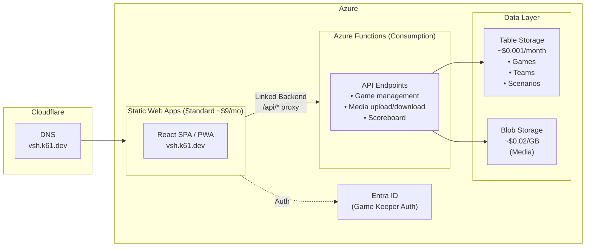

# Video Scavenger Hunt - Development Plan

**Production URL**: https://vsh.k61.dev

---

## 1. Overview

A multiplayer video scavenger hunt game where teams compete to act out scenarios and capture them on video. A game keeper manages the session and reviews submissions at the end.

### Core Flow
1. **Game Keeper** creates a game session with selected scenarios
2. **Players** join via game code, form teams (2-6 players each)
3. **Teams** complete scenarios by recording and uploading 30-second videos
4. **Real-time scoreboard** shows scenario completion count per team
5. **Game Keeper** can pause/resume game or adjust time limit mid-session
6. **Game Keeper** reviews all videos scenario-by-scenario, awards bonus points
7. **Final scores** displayed, videos can be cleaned up

---

## 2. Requirements Summary

| Requirement | Value |
|------------|-------|
| Team Size | 2-6 members (players + crew combined) |
| Teams per Game | 2-20 teams |
| Scenarios per Game | 5-25 (free pick from library) |
| Time Limit | 6 min/scenario default (60 min for 10), configurable |
| Video Duration | 30 seconds max |
| Scoring | 1 point per completion + 1 bonus point available per scenario |
| Video Retention | 7 days auto-delete, manual cleanup available |
| Real-time Updates | Within 30 seconds acceptable |

---

## 3. Platform: Progressive Web App (PWA)

Mobile-first responsive web app using modern browser APIs.

**Why PWA?**
- No app store approval needed - players join via QR code instantly
- Single codebase for all platforms (phones, tablets, laptops)
- Easy updates - deploy and everyone has the latest version
- MediaRecorder API can enforce 30-second video limit
- Fallback: allow file upload from camera roll if needed

**Browser Support**: MediaRecorder API is supported in Chrome, Firefox, Safari (14.3+), Edge.

**Accessibility**: Semantic HTML, full keyboard navigation, color-blind friendly icons displayed alongside colors.

**Camera Recording Flow**:
```
1. Player taps "Record Video" for scenario
2. Browser requests camera permission (one-time)
3. Live preview shows, countdown timer starts
4. Recording auto-stops at 30 seconds
5. Player previews video, confirms or re-records
6. Video uploads in background
```

---

## 4. Authentication & Authorization

**Game Keeper**: Authenticated via Microsoft Entra ID + authorized via email allowlist
**Players**: Anonymous with game code + team selection + display name

### Authentication (Who are you?)
- Sign in with Microsoft account via Entra ID
- Azure Static Web Apps provides built-in integration

### Authorization (Are you allowed?)
- After sign-in, email address is checked against an allowlist in Table Storage
- Only approved emails can access game keeper features
- Any existing game keeper can invite others by adding their email

**Unauthorized user flow:**
```
1. User signs in with Microsoft
2. Email not in allowlist
3. Shows error: "You're signed in as user@example.com but you're not 
   authorized as a game keeper. Ask an existing game keeper to invite you."
4. Option to sign out and try different account
```

**Why Hybrid?**
- Zero friction for players - just enter game code, pick team, set display name
- Secure management for game keeper - protects game creation, video cleanup
- Controlled access - only invited users can be game keepers
- Game codes are time-limited and single-use
- Works for all ages, no account creation required

**Player identity** = Team + Display Name (stored in session/local storage)

---

## 5. Architecture



**Architecture Notes:**
- **SWA Standard Tier** - Required for linked backends feature (~$9/month)
- **Linked Backend** - SWA proxies all `/api/*` requests to the Function App
- **Auth Header Forwarding** - SWA automatically forwards `x-ms-client-principal` to Function App
- **No CORS Required** - All traffic flows through SWA (same origin)
- **Media Uploads** - Proxied through Function App (not direct to blob) for auth validation
- **Cloudflare DNS** - CNAME pointing to SWA hostname (proxy disabled for SSL compatibility)

*Note: SignalR omitted from MVP - using polling for real-time updates instead.*

---

## 6. Azure Cost Estimate

### Complete Resource Breakdown

| Resource | Purpose | Pricing Model | Estimated Monthly Cost |
|----------|---------|---------------|------------------------|
| **Azure Static Web Apps (Standard)** | Host React PWA + linked backend | Standard tier | $9.00 |
| **Azure Functions (Consumption)** | API endpoints | Pay-per-execution | < $0.01 |
| **Azure Table Storage** | Games, teams, scenarios, scores | $0.00036/10K transactions + $0.045/GB | < $0.01 |
| **Azure Blob Storage** | Photos and videos | $0.02/GB stored + $0.004/10K operations | $0.02 - $0.10 |
| **Entra ID (for Game Keeper)** | Authentication | Free (included with Azure) | $0.00 |
| **Custom Domain (vsh.k61.dev)** | Subdomain of existing domain | Already owned | $0.00 |

### Storage Calculations

**Table Storage (per game):**
- 1 Game record: ~1 KB
- 20 Teams × ~500 bytes: ~10 KB
- 120 Players × ~200 bytes: ~24 KB
- 20 Scenario refs × ~100 bytes: ~2 KB
- **Total per game: ~40 KB** → thousands of games = still < 1 MB

**Blob Storage (per game):**
| Media Type | Size Each | Quantity (20 teams × 20 scenarios) | Total |
|------------|-----------|-------------------------------------|-------|
| Photos | ~500 KB | ~200 (50% of scenarios) | 100 MB |
| Videos | ~5 MB | ~200 (50% of scenarios) | 1 GB |
| **Per game total** | | | **~1.1 GB** |

### Monthly Cost Scenarios

| Scenario | Games/Month | Blob Storage | Table Storage | **Total** |
|----------|-------------|--------------|---------------|-----------|
| Personal use (1-2 games) | 2 | ~2 GB = $0.04 | < $0.01 | **~$0.05** |
| Monthly events (4 games) | 4 | ~4 GB = $0.08 | < $0.01 | **~$0.10** |
| Heavy use (10 games) | 10 | ~10 GB = $0.20 | < $0.01 | **~$0.25** |

*Note: Blob lifecycle policy auto-deletes media after 7 days, so storage doesn't accumulate.*

### One-Time vs Recurring

| Type | Resource | Cost |
|------|----------|------|
| **One-time** | Azure subscription | Free (pay-as-you-go) |
| **One-time** | Domain (if new) | ~$10-15/year |
| **Recurring** | Storage (Tables + Blobs) | ~$0.05-0.25/month |

### Optional Future Costs

| Resource | When Needed | Cost |
|----------|-------------|------|
| **Azure SignalR** | Real-time updates (>30s polling unacceptable) | $50/month |
| **Azure CDN** | Global distribution for large audiences | ~$0.08/GB |
| **Application Insights** | Monitoring/debugging | Free tier: 5GB/month |

### Cost Summary

| | Monthly | Annual |
|-|---------|--------|
| **Minimum (personal use)** | ~$9.05 | ~$109 |
| **Typical (monthly events)** | ~$9.10 | ~$110 |
| **Maximum (heavy use)** | ~$9.25 | ~$111 |

**Bottom line: The SWA Standard tier (~$9/month) is the primary cost. Storage costs are negligible.**

*Note: SWA Standard is required for the linked backend feature, which enables seamless API proxying and automatic auth header forwarding.*

---

## 7. Data Model

### Game
```typescript
interface Game {
  id: string;                    // Unique game ID (also the join code)
  createdBy: string;             // Game keeper's user ID
  createdAt: Date;
  status: 'lobby' | 'active' | 'paused' | 'judging' | 'complete';
  config: {
    timeLimit: number;           // Total minutes (can be adjusted mid-game)
  };
  scenarios: ScenarioRef[];      // Selected scenarios for this game
  startedAt?: Date;
  endsAt?: Date;
  pausedAt?: Date;               // When game was paused (null if not paused)
  totalPausedSeconds?: number;   // Accumulated pause time to adjust endsAt
}

interface ScenarioRef {
  scenarioId: string;
  order: number;
  bonusAwardedTo?: string;       // Team ID that got bonus point
}
```

### Team
```typescript
interface Team {
  id: string;
  gameId: string;
  name: string;                  // Max 20 chars, duplicates allowed
  color: string;                 // Auto-assigned from 8-color palette
  players: Player[];
  crewMembers: CrewMember[];     // Team members without phones
  completedScenarios: string[];  // Scenario IDs
}

interface Player {
  id: string;                    // Session-generated ID
  displayName: string;           // Duplicates allowed; identified by team + name
  joinedAt: Date;
}

interface CrewMember {
  id: string;                    // Generated ID
  displayName: string;           // Max 20 chars, same as players
  addedBy: string;               // Player ID who added them
  addedAt: Date;
}
```

### Player Session (localStorage)
```typescript
// Stored in localStorage to persist across page refreshes
interface PlayerSession {
  gameId: string;
  teamId: string;
  playerId: string;
  displayName: string;
  joinedAt: Date;
}
```

**Session Behavior**:
| Scenario | Behavior |
|----------|----------|
| Page refresh during game | ✅ Restored to team, sees current state |
| Page refresh after game ended | Shows results/judging screen |
| Different device/browser | Must rejoin (new player ID) |
| Game deleted by keeper | Clear session, show "game not found" |
```

### Scenario (Library)
```typescript
interface Scenario {
  id: string;
  title: string;                 // e.g., "Act out your best movie villain"
  description: string;           // Detailed instructions
  mediaType: 'photo' | 'video';  // What type of capture is required
  category: 'location' | 'general' | 'church' | string;  // For filtering/organization
  difficulty?: 'easy' | 'medium' | 'hard';
}
```

### Media Submission
```typescript
interface MediaSubmission {
  id: string;
  gameId: string;
  teamId: string;
  scenarioId: string;
  uploadedBy: string;            // Player ID
  blobUrl: string;
  uploadedAt: Date;
  mediaType: 'photo' | 'video';  // Matches scenario requirement
  status: 'uploading' | 'complete' | 'failed';  // Track upload progress/issues
  durationSeconds?: number;      // Only for videos
  errorMessage?: string;         // Details if status is 'failed'
}
```

### Game Keeper (Allowlist)
```typescript
interface GameKeeper {
  email: string;                 // Primary key (lowercase)
  displayName: string;           // From Microsoft profile
  addedBy: string;               // Email of who invited them
  addedAt: Date;
}
```

---

## 8. API Endpoints

### Game Management (Game Keeper Only)
```
POST   /api/games                    Create new game
GET    /api/games/:id                Get game details
PATCH  /api/games/:id                Update game config (including time limit)
POST   /api/games/:id/start          Start the game
POST   /api/games/:id/pause          Pause the game (freezes timer)
POST   /api/games/:id/resume         Resume paused game
POST   /api/games/:id/end            End game early / move to judging
DELETE /api/games/:id                Delete game and all videos
```

### Team/Player (Players)
```
POST   /api/games/:id/join           Join game (select team, set name)
GET    /api/games/:id/teams          Get all teams and completion counts
POST   /api/games/:id/teams/:teamId/crew  Add crew member (teammate without phone)
```

### Media Upload/Download
```
POST   /api/games/:id/videos/upload       Upload media file (proxied through Function App)
GET    /api/games/:id/videos              Get all videos (judging phase, returns SAS URLs)
GET    /api/games/:id/videos/:scenarioId  Get videos for specific scenario
```

*Note: Uploads are proxied through the Function App for authentication validation. The API returns signed download URLs for viewing.*

### Scoring (Game Keeper Only)
```
POST   /api/games/:id/bonus          Award bonus point for scenario
GET    /api/games/:id/scores         Get final scores
```

### Scenarios (Library - Game Keeper Only)
```
GET    /api/scenarios                List all scenarios
POST   /api/scenarios                Create new scenario
PUT    /api/scenarios/:id            Update existing scenario
DELETE /api/scenarios/:id            Delete scenario (blocked if used in active games)
```

**Scenario Request Body (POST/PUT):**
```typescript
{
  title: string;           // Required, max 100 chars
  description: string;     // Required, max 500 chars
  mediaType: 'photo' | 'video';
  category: string;        // 'location' | 'general' | 'church' | custom
  difficulty?: 'easy' | 'medium' | 'hard';
}
```

### Game Keeper Management (Game Keeper Only)
```
GET    /api/gamekeepers              List all game keepers (includes active/completed game counts)
POST   /api/gamekeepers              Invite new game keeper (by email)
DELETE /api/gamekeepers/:email       Remove game keeper
GET    /api/me                       Get current user's auth status and game keeper status
```

### Security
- **Rate Limiting**: 10 game code attempts per IP per minute to prevent brute-force guessing

### API Specification
All endpoints are documented using [TypeSpec](https://typespec.io/) in `/functions/api.tsp`. This provides:
- Strongly-typed request/response schemas
- Auto-generated OpenAPI 3.0 spec
- Client SDK generation for TypeScript
- Validation schemas for runtime checking

Run `npx tsp compile .` in the functions folder to regenerate the OpenAPI spec.

---

## 9. User Experiences

### 9.0 Landing Page (`vsh.k61.dev`)

All users arrive at the same landing page. The UI adapts based on authentication state:

```
┌─────────────────────────────────────┐
│       🎬 Video Scavenger Hunt       │
│                                     │
│  ┌─────────────────────────────┐    │
│  │  Enter Game Code: [____]    │    │  ← Players enter code here
│  │         [Join Game]         │    │
│  └─────────────────────────────┘    │
│                                     │
│            ─── or ───               │
│                                     │
│    [Sign in to Create a Game]       │  ← Game keeper clicks here
│                                     │
└─────────────────────────────────────┘
```

**Behavior by auth state:**
| State | What User Sees |
|-------|----------------|
| **Not signed in** | Game code input + "Sign in to Create a Game" link |
| **Signed in + authorized** | Game keeper dashboard with "Create Game" + "Game Keepers" dropdown |
| **Signed in + NOT authorized** | Error message with their email, prompt to request invite |

**Sign-in flow:**
1. User clicks "Sign in to Create a Game"
2. Redirects to Microsoft login (`/.auth/login/aad`)
3. User signs in with Microsoft account
4. Redirects back to `vsh.k61.dev`
5. App calls `/api/me` to check if email is in allowlist
6. If authorized → shows game keeper dashboard
7. If not authorized → shows error with email and invite instructions

**Unauthorized message example:**
```
┌─────────────────────────────────────────────────┐
│  ⚠️ Not Authorized                              │
│                                                 │
│  You're signed in as: user@example.com          │
│                                                 │
│  You're not registered as a game keeper.        │
│  Ask an existing game keeper to invite you.     │
│                                                 │
│  [Sign Out]  [Try Different Account]            │
└─────────────────────────────────────────────────┘
```

### 9.1 Game Keeper Flow

```
1. Sign in with Microsoft (via landing page)
2. Create New Game
   - Select scenario categories to include (location, general, church, etc.)
   - Select scenarios from the library (5-25)
   - Set time limit
   - Get shareable game code / QR code
3. Wait in Lobby
   - See teams forming, player counts
   - "Start Game" button when ready
4. During Game
   - View live scoreboard
   - Pause/Resume game (freezes timer for all players)
   - Adjust time limit mid-game (+5 min, +10 min, or custom)
   - Can end game early
5. Judging Phase
   - Scenario-by-scenario media review
   - View photos or play videos from each team
   - Award bonus point per scenario
   - "Next Scenario" to continue
6. Results
   - Final leaderboard
   - "Delete All Videos" cleanup button
   - "New Game" option
```

### 9.1.1 Scenario Management (Game Keeper Dashboard)

Game keepers can manage the scenario library from a dedicated tab in the dashboard:

```
┌─────────────────────────────────────────────────────┐
│  📋 My Games   │   📝 Scenarios                     │
├─────────────────────────────────────────────────────┤
│  [+ Add Scenario]                                   │
│                                                     │
│  📍 Location (10)                         [▼ Hide]  │
│  ┌─────────────────────────────────────────────┐    │
│  │ Gas Station Hero            🎬    [Edit][×] │    │
│  │ Frozen Performance          🎬    [Edit][×] │    │
│  │ Abbey Road                  🎬    [Edit][×] │    │
│  └─────────────────────────────────────────────┘    │
│                                                     │
│  🎭 General (9)                           [▼ Hide]  │
│  ┌─────────────────────────────────────────────┐    │
│  │ Viral Recreation            🎬    [Edit][×] │    │
│  │ Stranger Workout            🎬    [Edit][×] │    │
│  └─────────────────────────────────────────────┘    │
│                                                     │
│  ⛪ Church (4)                            [▼ Hide]  │
│  └─────────────────────────────────────────────┘    │
└─────────────────────────────────────────────────────┘
```

**Add/Edit Scenario Modal:**
```
┌────────────────────────────────────────┐
│  ✏️ Edit Scenario                  [×] │
├────────────────────────────────────────┤
│  Title:                                │
│  [Gas Station Hero________________]    │
│                                        │
│  Description:                          │
│  [Pump gas for a stranger at a    ]    │
│  [gas station____________________]     │
│                                        │
│  Media Type:   ○ 📷 Photo  ● 🎬 Video  │
│                                        │
│  Category:     [Location ▼]            │
│                                        │
│  Difficulty:   ○ Easy ○ Medium ○ Hard  │
│                                        │
│            [Cancel]  [Save]            │
└────────────────────────────────────────┘
```

**Delete Confirmation:**
- Scenarios used in active/recent games cannot be deleted
- Warning shown if scenario was used in past games
- Confirmation required before deletion

### 9.2 Player Flow

**Initial Join (Lobby):**
```
1. Scan QR code or enter game code → navigates to vsh.k61.dev/game/ABC123
2. Enter display name
3. Select team (or create new team)
4. Session saved to localStorage
5. Wait in Lobby
   - See team members (players and crew), other teams
   - Option to "Add Crew Member" for teammates without phones
```

**Late Join (Game in Progress):**
```
1. Scan QR code or enter game code
2. See message: "Game in progress! Join an existing team to jump in."
3. Enter display name
4. Select from teams with open slots (no "Create New Team" option)
   - If all teams full: "Sorry, all teams are full."
5. Session saved to localStorage
6. Immediately see scenario list and can start capturing
```

**Join Blocked (Game Ended):**
```
1. Scan QR code or enter game code
2. See message: "This game has ended."
3. No join options available
```

**Page Refresh / Return:**
```
1. Check localStorage for existing session
2. Validate session with API (game exists, team valid)
3. If valid → restore to current game state
4. If invalid → clear session, show join screen
```

**During Game:**
```
1. Game Active
   - See list of scenarios with status (photo icon or video icon)
   - Tap scenario to capture media
   - If photo: Camera opens, tap to capture, preview and confirm
   - If video: Camera opens with 30-second countdown, auto-stops
   - Preview and confirm upload
   - See scenario marked complete
   - View mini scoreboard (completion counts)
   - Can still add crew members (if team not at 6-member limit)
2. Time's Up
   - See final completion scoreboard
   - Wait for game keeper to start judging
3. Judging (View Only)
   - Optional: Watch along as game keeper plays videos
4. Results
   - See final scores with bonus points
```

---

## 10. Media Capture Implementation

### Photo vs Video Capture

Scenarios specify whether they require a photo or a 30-second video. The app dynamically switches capture mode based on the selected scenario's `mediaType` field.

| Media Type | Capture Method | File Format | Max Size | Audio |
|------------|----------------|-------------|----------|-------|
| **Photo** | `getUserMedia` + canvas snapshot | JPEG | ~500KB | N/A |
| **Video** | MediaRecorder API | MP4 (preferred) or WebM fallback | ~5MB | Always captured; mute available during playback |

**Video Format Strategy**: Prefer MP4 (H.264) for universal iOS/Android compatibility. Fall back to WebM only if MP4 is not supported (e.g., older Firefox). Both formats are accepted for playback.

**Camera Permission Denied**: If user denies camera access, show instructions to enable in browser settings. File upload fallback is always available.

### Video: MediaRecorder API Approach

```typescript
function getPreferredMimeType(): string {
  // Prefer MP4 for universal iOS/Android compatibility
  if (MediaRecorder.isTypeSupported('video/mp4')) {
    return 'video/mp4';
  }
  // Fallback to WebM (Firefox, older browsers)
  if (MediaRecorder.isTypeSupported('video/webm;codecs=vp9')) {
    return 'video/webm;codecs=vp9';
  }
  return 'video/webm';
}

async function startRecording(): Promise<Blob> {
  const mimeType = getPreferredMimeType();
  const stream = await navigator.mediaDevices.getUserMedia({
    video: { facingMode: 'environment', width: 1280, height: 720 },
    audio: true
  });
  
  const recorder = new MediaRecorder(stream, { mimeType });
  
  const chunks: Blob[] = [];
  recorder.ondataavailable = (e) => chunks.push(e.data);
  
  recorder.start();
  
  // Auto-stop at 30 seconds
  setTimeout(() => recorder.stop(), 30000);
  
  return new Promise((resolve) => {
    recorder.onstop = () => {
      stream.getTracks().forEach(t => t.stop());
      resolve(new Blob(chunks, { type: mimeType }));
    };
  });
}
```

### Photo: Canvas Snapshot Approach

```typescript
async function capturePhoto(): Promise<Blob> {
  const stream = await navigator.mediaDevices.getUserMedia({
    video: { facingMode: 'environment', width: 1280, height: 720 }
  });
  
  const video = document.createElement('video');
  video.srcObject = stream;
  await video.play();
  
  // Wait for user to tap capture button, then:
  const canvas = document.createElement('canvas');
  canvas.width = video.videoWidth;
  canvas.height = video.videoHeight;
  canvas.getContext('2d')!.drawImage(video, 0, 0);
  
  stream.getTracks().forEach(t => t.stop());
  
  return new Promise((resolve) => {
    canvas.toBlob((blob) => resolve(blob!), 'image/jpeg', 0.85);
  });
}
```

### Fallback: File Upload
```typescript
// For browsers with poor MediaRecorder/camera support
<input 
  type="file" 
  accept={scenario.mediaType === 'photo' ? 'image/*' : 'video/*'}
  capture="environment"
  onChange={handleFileSelect}
/>

function handleFileSelect(file: File) {
  // Validate file type matches scenario.mediaType
  // For videos: validate duration client-side (approximate via file size or Video element)
  // Upload to blob storage
}
```

### Video Upload Flow

```
1. Client requests SAS token from API
2. API generates time-limited SAS URL for blob upload
3. Client uploads directly to Azure Blob Storage
4. Client notifies API that upload is complete
5. API updates game state, marks scenario complete for team
```

---

## 11. Real-Time Updates

### Polling Approach (Recommended for MVP)

```typescript
// Poll every 15 seconds during active game
useEffect(() => {
  const interval = setInterval(async () => {
    const teams = await fetch(`/api/games/${gameId}/teams`);
    setTeamScores(teams);
  }, 15000);
  
  return () => clearInterval(interval);
}, [gameId]);
```

### SignalR Approach (Future Enhancement)

```typescript
const connection = new signalR.HubConnectionBuilder()
  .withUrl('/api/scorehub')
  .build();

connection.on('ScoreUpdated', (teamId, completedCount) => {
  updateScoreboard(teamId, completedCount);
});
```

---

## 12. Video Storage & Cleanup

### Blob Structure
```
media/
  {gameId}/
    {teamId}/
      {scenarioId}.mp4    # For video scenarios (or .webm fallback)
      {scenarioId}.jpg    # For photo scenarios
```

### Auto-Cleanup (7 Days)

Use Azure Blob Storage Lifecycle Management:
```json
{
  "rules": [
    {
      "name": "DeleteOldVideos",
      "type": "Lifecycle",
      "definition": {
        "filters": {
          "blobTypes": ["blockBlob"],
          "prefixMatch": ["media/"]
        },
        "actions": {
          "baseBlob": {
            "delete": { "daysAfterCreationGreaterThan": 7 }
          }
        }
      }
    }
  ]
}
```

### Manual Cleanup

Game keeper can trigger immediate deletion:
```
DELETE /api/games/:id → Deletes all blobs in media/{gameId}/ + database records
```

### Scheduled Cleanup (Timer Function)

A scheduled Azure Function runs daily to clean up expired data:

```typescript
// Timer trigger: runs daily at 2:00 AM UTC
export async function cleanupExpiredGames(timer: Timer): Promise<void> {
  const cutoffDate = new Date(Date.now() - 7 * 24 * 60 * 60 * 1000); // 7 days ago
  
  // 1. Find games older than 7 days
  const expiredGames = await tableClient.listEntities({
    filter: `createdAt lt datetime'${cutoffDate.toISOString()}'`
  });
  
  for (const game of expiredGames) {
    // 2. Delete all blobs for this game (belt and suspenders with lifecycle policy)
    await deleteContainer(`media/${game.id}`);
    
    // 3. Delete Table Storage records
    await deleteGameRecords(game.id);  // Game, Teams, Players, MediaSubmissions
  }
  
  console.log(`Cleaned up ${count} expired games`);
}
```

**What gets cleaned up:**
| Data | Storage | Cleanup Method |
|------|---------|----------------|
| Photos/Videos | Blob Storage | Lifecycle policy + scheduled function |
| Game records | Table Storage | Scheduled function |
| Team records | Table Storage | Scheduled function |
| MediaSubmission records | Table Storage | Scheduled function |
| Game codes | Released for reuse after cleanup |

---

## 13. Technology Stack

### Frontend
- **Framework**: React 18 with TypeScript
- **Build**: Vite
- **Styling**: Tailwind CSS
- **PWA**: Vite PWA plugin
- **Video**: MediaRecorder API + Video element
- **State**: React Query for server state
- **Hosting**: Azure Static Web Apps

### Backend
- **Runtime**: Azure Functions (Node.js 20, TypeScript) - standalone Consumption plan
- **API Proxy**: SWA Standard with linked backend (auto-forwards auth headers)
- **Database**: Azure Table Storage (simple key-value, ultra low cost)
- **Storage**: Azure Blob Storage (uploads proxied through Function App)
- **Auth**: Azure Entra ID (via SWA built-in auth)

### DevOps
- **Repo**: GitHub (kurtzeborn/scavenger-hunt)
- **CI/CD**: GitHub Actions (SWA auto-generates workflow)
- **Deploy**: Azure Static Web Apps auto-deploy → vsh.k61.dev

### Testing
- **Framework**: Vitest (for both frontend and functions)
- **API Tests**: Unit tests for all Azure Function endpoints
- **Mocking**: Mock Table Storage and Blob Storage for isolated tests
- **Coverage**: Aim for 80%+ coverage on API endpoints

**API Test Strategy:**
```typescript
// Example: tests/api/games.test.ts
describe('POST /api/games', () => {
  it('creates a game when authenticated as game keeper', async () => {
    const mockContext = createMockContext({ userId: 'keeper@example.com' });
    const response = await createGame(mockContext, mockRequest);
    expect(response.status).toBe(201);
    expect(response.body.id).toMatch(/^[A-Z]{4}$/);  // 4-letter game code
  });

  it('returns 401 when not authenticated', async () => {
    const mockContext = createMockContext({ userId: null });
    const response = await createGame(mockContext, mockRequest);
    expect(response.status).toBe(401);
  });

  it('returns 403 when authenticated but not a game keeper', async () => {
    const mockContext = createMockContext({ userId: 'random@example.com' });
    const response = await createGame(mockContext, mockRequest);
    expect(response.status).toBe(403);
  });
});
```

**What to test:**
| Endpoint | Key Test Cases |
|----------|----------------|
| `POST /api/games` | Auth required, game keeper only, generates valid code |
| `POST /api/games/:id/join` | Valid game code, team creation, player limits |
| `POST /api/games/:id/videos` | SAS token generation, first-upload-wins, timer grace period |
| `POST /api/games/:id/bonus` | Game keeper only, one bonus per scenario |
| `GET /api/me` | Returns auth status and game keeper status |

---

## 14. Project Structure

```
scavenger-hunt/
├── README.md
├── docs/
│   └── plan.md
├── web/                          # React PWA
│   ├── package.json
│   ├── vite.config.ts
│   ├── index.html
│   └── src/
│       ├── main.tsx
│       ├── App.tsx
│       ├── components/
│       │   ├── GameKeeper/
│       │   ├── Player/
│       │   └── shared/
│       ├── hooks/
│       ├── api/
│       └── types/
├── functions/                    # Azure Functions
│   ├── package.json
│   ├── host.json
│   ├── tsconfig.json
│   └── src/
│       ├── games/
│       ├── teams/
│       ├── videos/
│       ├── scenarios/
│       └── shared/
└── infrastructure/               # Bicep/ARM templates
    ├── main.bicep
    └── modules/
```

---

## 15. Development Phases

### Phase 1: Foundation (Week 1-2) ✅ COMPLETE
- [x] Project setup (React + Vite + TypeScript + Tailwind CSS)
- [x] Azure Functions setup (Node.js 20 + TypeScript)
- [x] Basic authentication (Entra ID via SWA, game keeper allowlist)
- [x] Azure Table Storage setup and data models
- [x] Game CRUD operations (create, read, update, delete, start)
- [x] Scenario library (seeded with 23 scenarios across 3 categories)
- [x] React app shell with routing (Landing, Dashboard, CreateGame, Game pages)
- [x] Local development environment with WSL support
- [x] Documentation (DEVELOPMENT.md, copilot-instructions.md)

### Phase 2: Core Gameplay (Week 3-4) ✅ COMPLETE
- [x] Player join flow (game code, team selection)
- [x] Lobby experience (waiting for game start)
- [x] Scenario list UI
- [x] Video capture with MediaRecorder
- [x] Video upload to Blob Storage
- [x] Scenario completion tracking

### Phase 2.1: Crew Members & Late Joining ✅
Support for team members who participate but don't have their own device, plus allowing players to join teams after the game has started.

**Backend - Crew Members:**
- [x] Add `crewMembers` array to Team entity in Table Storage
- [x] Create `POST /api/games/:id/teams/:teamId/crew` endpoint
  - Validates: game exists, team exists, caller is team member, team not at 6-member limit
  - Adds crew member with generated ID, display name, addedBy, addedAt
  - Returns updated team
- [x] Update `GET /api/games/:id/teams` to include crew members in response
- [x] Enforce combined player + crew limit of 6 per team

**Backend - Late Player Joining:**
- [x] Update `POST /api/games/:id/join` to allow joins when game status is `active` or `paused`
  - Reject if status is `judging` or `complete`
  - Reject if trying to create a new team (existing teams only after game starts)
  - Only show teams with open slots (< 6 members)
  - If all teams are full, return error with friendly message

**Frontend - Crew Members:**
- [x] Add "Add Crew Member" button in team roster (lobby only - active game deferred)
- [x] Simple modal: enter crew member name (max 20 chars)
- [x] Display crew members in team roster with distinct icon (👤 vs 📱)
- [x] Show crew members in game keeper's lobby view
- [x] Update team member count display to show "X/6 members"

**Frontend - Late Player Joining:**
- [x] Update JoinGameFlow to detect game state
- [x] If game is `active` or `paused`:
  - Show message: "Game in progress! Join an existing team to jump in."
  - Hide "Create New Team" option
  - Only display teams with available slots
  - If no teams have slots: "Sorry, all teams are full."
- [x] If game is `judging` or `complete`:
  - Show message: "This game has ended."
  - No join options available

**Additional UI Improvements:**
- [x] Game keeper view: home button to return to dashboard
- [x] Game keeper view: show total uploads counter across all teams

**UX Considerations:**
- Crew members cannot be removed once added
- Crew members cannot "upgrade" to players
- Crew members are visible to all team members and game keeper
- Messaging: "Don't have a phone? Ask a teammate to add you as crew!"
- Late joiners see all scenarios and can immediately start capturing

### Phase 3: Real-Time & Scoring (Week 5) ✅ COMPLETE

**Backend - Game Control:**
- [x] `POST /api/games/:id/pause` - Set status to 'paused', record `pausedAt` timestamp
- [x] `POST /api/games/:id/resume` - Set status to 'active', add elapsed pause time to `totalPausedSeconds`, extend `endsAt`
- [x] `POST /api/games/:id/end` - Transition game to 'judging' status (validates game is active/paused)
- [x] `POST /api/games/:id/complete` - Finish judging and transition to 'complete' status

**Backend - Scoring:**
- [x] `POST /api/games/:id/bonus` - Award bonus point for a scenario to a team
  - Body: `{ scenarioId: string, teamId: string }` (teamId can be changed until game is complete)
  - Updates `ScenarioRef.bonusAwardedTo` in game entity

**Backend - Video Retrieval:**
- [x] `GET /api/games/:id/videos` - Get all videos for a game (judging phase)
- [x] `GET /api/games/:id/videos/:scenarioId` - Get videos for specific scenario
  - Returns secure blob URLs with read-only SAS tokens (1-hour expiry)

**Frontend - Timer Improvements:**
- [x] Timer color changes: green (>10 min) → yellow (≤10 min) → red (≤1 min)
- [x] Auto-transition to "Time's Up" screen when timer expires
- [x] Pause indicator when game is paused (frozen timer, overlay message)
- [x] Game keeper controls: Pause/Resume buttons, "End Game" button

**Frontend - Judging Phase (Carousel UX):**
- [x] Scenario carousel: navigate through scenarios with prev/next and dot navigation
- [x] Grid layout of team video thumbnails for each scenario
- [x] Tap thumbnail to play video/view photo in modal with controls
- [x] Star icon on each thumbnail (radio-button style, one selected per scenario)
- [x] "Previous" / "Next" navigation buttons
- [x] "Finish" button on last scenario → transition to 'complete'

**Frontend - Results Screen (Dramatic Reveal):**
- [x] Reveal teams one-by-one from worst to best (~2 second delay between)
- [x] Show position, team name, team color, and final score
- [x] Ties display at same position (e.g., "1st Place: Team A, Team B")
- [x] Winner announcement banner with animation
- [x] "New Game" and "Back to Dashboard" buttons for game keeper
- [x] "Skip animation" option for impatient users

**Frontend - State Transitions:**
- [x] Players: "Time's Up" screen when timer expires, waiting for judging
- [x] Players: Waiting screen during judging phase
- [x] Players: Results screen after game is complete
- [x] Handle `paused` state: show pause overlay, disable captures

**Design Decisions (Phase 3):**
- No vibration alerts (removed)
- Ties are acceptable (no tie-breaker logic)
- Bonus points changeable until "Finish Judging" is clicked
- Game keeper can end game early even if time remains

**Deferred to Phase 4:**
- 60-second grace period for in-progress uploads
- GET /api/games/:id/scores endpoint (scores calculated client-side from teams + game data)

### Phase 4: Polish & Deployment (Week 6) ✅ COMPLETE

**Deployment (Complete):**
- [x] Azure Static Web Apps (Standard tier) deployment
- [x] Azure Functions (Consumption plan) deployment
- [x] Linked backend configuration (SWA proxies /api/* to Function App)
- [x] Configure Entra ID authentication
- [x] Custom domain setup (vsh.k61.dev via Cloudflare DNS)
- [x] Blob lifecycle policy (7-day auto-delete)
- [x] GitHub Actions CI/CD pipeline
- [x] Media upload proxied through Function App

**Scenario Management (Deferred to Phase 6):**
- [ ] `POST /api/scenarios` - Create new scenario (game keeper only)
- [ ] `PUT /api/scenarios/:id` - Update existing scenario
- [ ] `DELETE /api/scenarios/:id` - Delete scenario (block if used in active games)
- [ ] Dashboard "Scenarios" tab with category grouping
- [ ] Add/Edit scenario modal with form validation
- [ ] Delete confirmation with usage check

**Polish (Phase 5):**
- [x] PWA manifest and service worker (install-only, no offline caching)
- [x] QR code generation for game codes (game keeper lobby)
- [x] Responsive design polish for small screens (CAT S22 Flip at ~240px)
- [x] Unit tests for Azure Functions (auth module)
- [x] Smoke tests for deployment (tests/smoke.js)

### Phase 5: Polish (Completed)
- [x] PWA: Added manifest.json with 512x512 icon, theme colors, service worker for installability
- [x] QR Code: Added QR button next to game code in lobby, opens modal with scannable code
- [x] Responsive: Updated all screens for 240px minimum width (CAT S22 Flip support)
- [x] Unit tests: Added 10 tests for auth module (getAuthUser, isGameKeeper)
- [x] Smoke tests: Added 5 health check tests for production deployment

### Phase 5.1: Cleanup
- [x] Blob lifecycle policy: Configure Azure Storage to auto-delete blobs after 7 days
- [x] Timer function: `cleanupExpiredGames` runs daily to delete games/teams older than 7 days
- [x] Delete button: Add "Delete Game" button on completed games in dashboard (deletes game, teams, and blobs)

### Phase 5.2: Game Keepers List
- [x] Dashboard: Replace "Invite Game Keeper" button with "Game Keepers" dropdown (Add Game Keeper + View List)
- [x] New `/gamekeepers` route with dedicated page listing all game keepers
- [x] Each keeper card shows: display name, email, added by, added date, active game count, completed game count
- [x] `GET /api/gamekeepers` updated to return `addedBy`, `activeGames`, and `completedGames` per keeper
- [x] Cache invalidation: adding a keeper refreshes the list page data
- [x] Keepers sorted alphabetically by display name
- [x] Escape key closes dropdown menu

### Phase 6: Future Enhancements
- [ ] Pre-assigned teams mode (game keeper creates teams in advance)
- [ ] SignalR for instant updates (if needed)
- [ ] Per-game custom scenarios (one-off scenarios not saved to library)
- [ ] Media thumbnails for quick review
- [ ] Share/download final media compilation

---

## 16. Scenario Library (Sample Set)

Here are sample scenarios to seed the library. Each scenario specifies a **media type** (📷 photo or 🎬 video) and a **category**.

### Location-Based Scenarios
| # | Title | Description | Media |
|---|-------|-------------|-------|
| 1 | **Gas Station Hero** | Pump gas for a stranger at a gas station | 🎬 video |
| 2 | **Frozen Performance** | Sing "Once there was a snowman" in the frozen foods section | 🎬 video |
| 3 | **Abbey Road** | Walk across a crosswalk like the Beatles | 🎬 video |
| 4 | **YMCA at the Y** | Sing and dance to YMCA in front of a gym | 🎬 video |
| 5 | **Civic Duty** | Give a short speech in front of a government building | 🎬 video |
| 6 | **Fountain Swimmers** | Make swimming and diving motions in front of a fountain | 🎬 video |
| 7 | **Playground Pro** | Swing from monkey bars | 📷 photo |
| 8 | **Tree Huggers** | Group hug a tree | 📷 photo |
| 9 | **Play Ball** | Sing the last line of the National Anthem at a baseball diamond | 🎬 video |
| 10 | **Wrong Restaurant** | Go to McDonald's and try to order a Whopper | 🎬 video |

### General Scenarios
| # | Title | Description | Media |
|---|-------|-------------|-------|
| 11 | **Viral Recreation** | Recreate a famous viral or meme video | 🎬 video |
| 12 | **Stranger Workout** | Do at least 5 pushups together with a stranger | 🎬 video |
| 13 | **Movie Moment** | Reenact a short scene from your favorite movie | 🎬 video |
| 14 | **Nature Documentary** | Film something ordinary and narrate it like wildlife | 🎬 video |
| 15 | **Duck Walk** | Waddle in a line like ducks | 🎬 video |
| 16 | **Human Punctuation** | Form a human period at a mall | 📷 photo |
| 17 | **Cart Racers** | Two team members being pushed in a shopping cart | 🎬 video |
| 18 | **Photo Finish** | Race on a track with a dramatic finish | 📷 photo |
| 19 | **Fitness Fanatic** | Do jumping jacks in front of a gym | 🎬 video |

### Church Scenarios
| # | Title | Description | Media |
|---|-------|-------------|-------|
| 20 | **Chapel Choir** | Sing a hymn together inside a church | 🎬 video |
| 21 | **Steeple Selfie** | Group photo with a church steeple in the background | 📷 photo |
| 22 | **Painting Copy** | Pose as subjects in a painting with the actual painting in background | 📷 photo |
| 24 | **Pew Pose** | Team sitting reverently in church pews | 📷 photo |

---

## 17. Design Decisions

| Decision | Resolution |
|----------|------------|
| **Team Creation** | Self-organizing: Players create/join teams when entering game. First player names the team, others can join existing teams or create new ones (up to max 20 teams). |
| **Crew Members** | Team members without phones. Any player can add crew members. Can be added in lobby or during active game. Count toward 6-member team limit. Cannot be removed or upgraded to players. |
| **Team Locking** | Teams lock once game starts (no new teams created). However, players can still join existing teams with open slots during `active` or `paused` states. No joins during `judging` or `complete`. |
| **Empty Teams** | Auto-deleted if empty when game starts. |
| **Minimum to Start** | At least 2 teams with 1+ players each required. |
| **Player Kick** | Not in MVP; game keeper can delete entire game if needed. |
| **Scenario Order** | All teams get same scenarios; teams complete them in any order they choose. |
| **Video Re-recording** | Players can preview and re-record before uploading. Once uploaded, that scenario is locked for the team. |
| **Judging Visibility** | Only game keeper can control video playback during judging. UI designed to be projected on a shared screen for everyone to watch together. |
| **Tie Breaker** | If teams have same score, the team that completed their scenarios fastest wins. |
| **Game History** | Completed games remain viewable until videos expire (7 days). Game keeper can download videos during this period. |

### Error Handling
| Scenario | Behavior |
|----------|----------|
| **Upload failure** | Auto-retry 3x with exponential backoff, then show "Retry" button |
| **Simultaneous uploads** | First-upload-wins; reject subsequent uploads for same scenario |
| **Connection drop** | Queue uploads locally, sync when connection restored, show "offline" indicator |
| **Upload timeout** | 60 seconds before declaring failure |
| **Upload after timer expires** | Reject unless upload was in-progress before expiration (60s grace period) |

### Game Code Format
| Aspect | Decision |
|--------|----------|
| **Format** | 4 uppercase letters (A-Z, excluding O and I) |
| **Case sensitivity** | Case-insensitive (converted to uppercase on entry) |
| **Character set** | 24 letters → 24^4 = 331,776 combinations |
| **Collision avoidance** | Check for active/recent games before assigning |
| **Expiration** | Codes released 7 days after game ends (when media deleted) |

### Timer UX
| Aspect | Decision |
|--------|----------|
| **Display** | Persistent header bar, format `45:30` (no label) |
| **Color changes** | Green (>10 min) → Yellow (≤10 min) → Red (≤1 min) |
| **Alerts** | Vibrate at 5 min and 1 min remaining |
| **Expiration** | 60-second grace period for in-progress uploads, then hard lock |
| **Post-expiry** | Auto-redirect to "Waiting for judging" screen with "Time's up!" toast |

### Future Enhancements (Post-MVP)
- **Pre-Assigned Teams**: Game keeper creates teams in advance, players select from existing teams only (useful for corporate team-building events)

### Branding Assets
Logo and icon assets are available in `/logo/`:
- `vsh_icon.png` - App icon (PWA, favicon)
- `vsh_logo.png` - Full logo for headers and splash screens

---

## 18. Success Metrics

- **Performance**: Video upload completes within 10 seconds for 30-second video
- **Reliability**: 99% uptime during active games
- **Usability**: Player can join and record first video within 2 minutes
- **Scale**: Support 20 teams × 6 players = 120 concurrent players
- **Cost**: Stay under $50/month for typical usage
