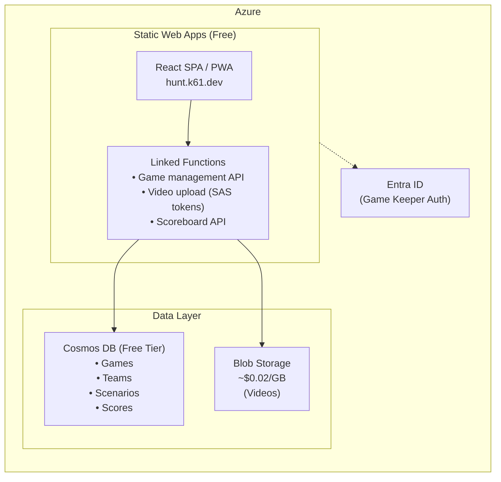

# Video Scavenger Hunt - Development Plan

**Production URL**: https://hunt.k61.dev

## 1. Overview

A multiplayer video scavenger hunt game where teams compete to act out scenarios and capture them on video. A game keeper manages the session and reviews submissions at the end.

### Core Flow
1. **Game Keeper** creates a game session with selected scenarios
2. **Players** join via game code, form teams (2-6 players each)
3. **Teams** complete scenarios by recording and uploading 30-second videos
4. **Real-time scoreboard** shows scenario completion count per team
5. **Game Keeper** reviews all videos scenario-by-scenario, awards bonus points
6. **Final scores** displayed, videos can be cleaned up

---

## 2. Requirements Summary

| Requirement | Value |
|------------|-------|
| Team Size | 2-6 players |
| Teams per Game | 2-20 teams |
| Scenarios per Game | 10 (default), 15, or 20 |
| Time Limit | 6 min/scenario default (60 min for 10), configurable |
| Video Duration | 30 seconds max |
| Scoring | 1 point per completion + 1 bonus point available per scenario |
| Video Retention | 7 days auto-delete, manual cleanup available |
| Real-time Updates | Within 30 seconds acceptable |

---

## 3. Platform: Progressive Web App (PWA)

Mobile-first responsive web app using modern browser APIs.

**Why PWA?**
- No app store approval needed - players join via QR code instantly
- Single codebase for all platforms (phones, tablets, laptops)
- Easy updates - deploy and everyone has the latest version
- MediaRecorder API can enforce 30-second video limit
- Fallback: allow file upload from camera roll if needed

**Browser Support**: MediaRecorder API is supported in Chrome, Firefox, Safari (14.3+), Edge.

**Camera Recording Flow**:
```
1. Player taps "Record Video" for scenario
2. Browser requests camera permission (one-time)
3. Live preview shows, countdown timer starts
4. Recording auto-stops at 30 seconds
5. Player previews video, confirms or re-records
6. Video uploads in background
```

---

## 4. Authentication: Hybrid Approach

**Game Keeper**: Authenticated via Microsoft Entra ID (required to create/manage games)
**Players**: Anonymous with game code + team selection + display name

**Why Hybrid?**
- Zero friction for players - just enter game code, pick team, set display name
- Secure management for game keeper - protects game creation, video cleanup
- Game codes are time-limited and single-use
- Works for all ages, no account creation required
- Azure Static Web Apps provides built-in Entra ID integration

**Player identity** = Team + Display Name (stored in session/local storage)

---

## 5. Architecture



**Why Azure Static Web Apps?**
- Built-in Entra ID authentication (zero-code config for game keeper login)
- Integrated API routing (no CORS headaches - frontend and API on same domain)
- Free tier: 100GB bandwidth, 2 custom domains
- Simpler management with everything in Azure

*Note: SignalR omitted from MVP - using polling for real-time updates instead.*

---

## 6. Azure Cost Analysis

### Free Tier Components

| Service | Free Tier Limits | Our Usage Estimate |
|---------|-----------------|-------------------|
| **Azure Static Web Apps** | 100GB bandwidth, 2 custom domains, built-in auth | ✅ Sufficient |
| **Azure Functions (via SWA)** | 1M executions/month | ✅ Sufficient |
| **Azure Cosmos DB (Free Tier)** | 1000 RU/s, 25GB storage | ✅ Sufficient |

### Paid Components

| Service | Cost | Notes |
|---------|------|-------|
| **Azure Blob Storage** | ~$0.02/GB/month | Videos stored here. 1 game (20 teams × 20 scenarios × 5MB) = 2GB ≈ $0.04 |
| **Azure SignalR (Standard)** | $50/month per unit | Only needed if >20 concurrent connections. 1 unit = 1000 connections |

### Cost Scenarios

**Small Event (10 teams, 10 scenarios)**
- Storage: ~500MB = $0.01/month
- SignalR: Free tier sufficient (10 teams × 4 avg players = 40 connections) ⚠️ May hit free limit
- **Total: ~$0.01-$50/month** (depends on SignalR needs)

**Large Event (20 teams, 20 scenarios)**
- Storage: ~2GB = $0.04/month
- SignalR: Standard tier likely needed = $50/month
- **Total: ~$50/month**

### Alternative: Polling Instead of SignalR

To stay fully free, we could use polling (every 15-30 seconds) instead of SignalR:
- Slightly higher API calls but within free tier
- 30-second update requirement is easily met
- **Recommendation**: Start with polling, add SignalR later if needed

---

## 7. Data Model

### Game
```typescript
interface Game {
  id: string;                    // Unique game ID (also the join code)
  createdBy: string;             // Game keeper's user ID
  createdAt: Date;
  status: 'lobby' | 'active' | 'judging' | 'complete';
  config: {
    scenarioCount: 10 | 15 | 20;
    timeLimit: number;           // Total minutes
    timeLimitPerScenario: number;
  };
  scenarios: ScenarioRef[];      // Selected scenarios for this game
  startedAt?: Date;
  endsAt?: Date;
}

interface ScenarioRef {
  scenarioId: string;
  order: number;
  bonusAwardedTo?: string;       // Team ID that got bonus point
}
```

### Team
```typescript
interface Team {
  id: string;
  gameId: string;
  name: string;
  color: string;                 // For UI display
  players: Player[];
  completedScenarios: string[];  // Scenario IDs
}

interface Player {
  id: string;                    // Session-generated ID
  displayName: string;
  joinedAt: Date;
}
```

### Player Session (localStorage)
```typescript
// Stored in localStorage to persist across page refreshes
interface PlayerSession {
  gameId: string;
  teamId: string;
  playerId: string;
  displayName: string;
  joinedAt: Date;
}
```

**Session Behavior**:
| Scenario | Behavior |
|----------|----------|
| Page refresh during game | ✅ Restored to team, sees current state |
| Page refresh after game ended | Shows results/judging screen |
| Different device/browser | Must rejoin (new player ID) |
| Game deleted by keeper | Clear session, show "game not found" |
```

### Scenario (Library)
```typescript
interface Scenario {
  id: string;
  title: string;                 // e.g., "Act out your best movie villain"
  description: string;           // Detailed instructions
  category?: string;             // For filtering/organization
  difficulty?: 'easy' | 'medium' | 'hard';
}
```

### Video Submission
```typescript
interface VideoSubmission {
  id: string;
  gameId: string;
  teamId: string;
  scenarioId: string;
  uploadedBy: string;            // Player ID
  blobUrl: string;
  uploadedAt: Date;
  durationSeconds: number;
}
```

---

## 8. API Endpoints

### Game Management (Game Keeper Only)
```
POST   /api/games                    Create new game
GET    /api/games/:id                Get game details
PATCH  /api/games/:id                Update game config
POST   /api/games/:id/start          Start the game
POST   /api/games/:id/end            End game early / move to judging
DELETE /api/games/:id                Delete game and all videos
```

### Team/Player (Players)
```
POST   /api/games/:id/join           Join game (select team, set name)
GET    /api/games/:id/teams          Get all teams and completion counts
```

### Videos
```
POST   /api/games/:id/videos/upload-url   Get SAS URL for upload
POST   /api/games/:id/videos              Register uploaded video
GET    /api/games/:id/videos              Get all videos (judging phase)
GET    /api/games/:id/videos/:scenarioId  Get videos for specific scenario
```

### Scoring (Game Keeper Only)
```
POST   /api/games/:id/bonus          Award bonus point for scenario
GET    /api/games/:id/scores         Get final scores
```

### Scenarios (Library)
```
GET    /api/scenarios                List all scenarios
POST   /api/scenarios                Add new scenario (admin)
```

---

## 9. User Experiences

### 9.1 Game Keeper Flow

```
1. Sign in with Microsoft
2. Create New Game
   - Select scenario count (10/15/20)
   - Set time limit
   - Get shareable game code / QR code
3. Wait in Lobby
   - See teams forming, player counts
   - "Start Game" button when ready
4. During Game
   - View live scoreboard
   - Can end game early
5. Judging Phase
   - Scenario-by-scenario video review
   - Play videos from each team
   - Award bonus point per scenario
   - "Next Scenario" to continue
6. Results
   - Final leaderboard
   - "Delete All Videos" cleanup button
   - "New Game" option
```

### 9.2 Player Flow

**Initial Join:**
```
1. Scan QR code or enter game code → navigates to hunt.k61.dev/game/ABC123
2. Enter display name
3. Select team (or create new team)
4. Session saved to localStorage
5. Wait in Lobby
   - See team members, other teams
```

**Page Refresh / Return:**
```
1. Check localStorage for existing session
2. Validate session with API (game exists, team valid)
3. If valid → restore to current game state
4. If invalid → clear session, show join screen
```

**During Game:**
```
1. Game Active
   - See list of scenarios with status
   - Tap scenario to record video
   - Camera opens with 30-second countdown
   - Preview and confirm upload
   - See scenario marked complete
   - View mini scoreboard (completion counts)
2. Time's Up
   - See final completion scoreboard
   - Wait for game keeper to start judging
3. Judging (View Only)
   - Optional: Watch along as game keeper plays videos
4. Results
   - See final scores with bonus points
```

---

## 10. Video Capture Implementation

### MediaRecorder API Approach

```typescript
async function startRecording(): Promise<Blob> {
  const stream = await navigator.mediaDevices.getUserMedia({
    video: { facingMode: 'environment', width: 1280, height: 720 },
    audio: true
  });
  
  const recorder = new MediaRecorder(stream, {
    mimeType: 'video/webm;codecs=vp9'
  });
  
  const chunks: Blob[] = [];
  recorder.ondataavailable = (e) => chunks.push(e.data);
  
  recorder.start();
  
  // Auto-stop at 30 seconds
  setTimeout(() => recorder.stop(), 30000);
  
  return new Promise((resolve) => {
    recorder.onstop = () => {
      stream.getTracks().forEach(t => t.stop());
      resolve(new Blob(chunks, { type: 'video/webm' }));
    };
  });
}
```

### Fallback: File Upload
```typescript
// For browsers with poor MediaRecorder support
<input 
  type="file" 
  accept="video/*" 
  capture="environment"
  onChange={handleFileSelect}
/>

function handleFileSelect(file: File) {
  // Validate duration client-side (approximate via file size or Video element)
  // Upload to blob storage
}
```

### Video Upload Flow

```
1. Client requests SAS token from API
2. API generates time-limited SAS URL for blob upload
3. Client uploads directly to Azure Blob Storage
4. Client notifies API that upload is complete
5. API updates game state, marks scenario complete for team
```

---

## 11. Real-Time Updates

### Polling Approach (Recommended for MVP)

```typescript
// Poll every 15 seconds during active game
useEffect(() => {
  const interval = setInterval(async () => {
    const teams = await fetch(`/api/games/${gameId}/teams`);
    setTeamScores(teams);
  }, 15000);
  
  return () => clearInterval(interval);
}, [gameId]);
```

### SignalR Approach (Future Enhancement)

```typescript
const connection = new signalR.HubConnectionBuilder()
  .withUrl('/api/scorehub')
  .build();

connection.on('ScoreUpdated', (teamId, completedCount) => {
  updateScoreboard(teamId, completedCount);
});
```

---

## 12. Video Storage & Cleanup

### Blob Structure
```
videos/
  {gameId}/
    {teamId}/
      {scenarioId}.webm
```

### Auto-Cleanup (7 Days)

Use Azure Blob Storage Lifecycle Management:
```json
{
  "rules": [
    {
      "name": "DeleteOldVideos",
      "type": "Lifecycle",
      "definition": {
        "filters": {
          "blobTypes": ["blockBlob"],
          "prefixMatch": ["videos/"]
        },
        "actions": {
          "baseBlob": {
            "delete": { "daysAfterCreationGreaterThan": 7 }
          }
        }
      }
    }
  ]
}
```

### Manual Cleanup

Game keeper can trigger immediate deletion:
```
DELETE /api/games/:id → Deletes all blobs in videos/{gameId}/ + database records
```

---

## 13. Technology Stack

### Frontend
- **Framework**: React 18 with TypeScript
- **Build**: Vite
- **Styling**: Tailwind CSS
- **PWA**: Vite PWA plugin
- **Video**: MediaRecorder API + Video element
- **State**: React Query for server state
- **Hosting**: Azure Static Web Apps

### Backend
- **Runtime**: Azure Functions (Node.js 20, TypeScript) - linked to SWA
- **Database**: Azure Cosmos DB (NoSQL, Free Tier)
- **Storage**: Azure Blob Storage
- **Auth**: Azure Entra ID (built-in via SWA)
- **Real-time**: Polling initially, SignalR later

### DevOps
- **Repo**: GitHub (kurtzeborn/scavenger-hunt)
- **CI/CD**: GitHub Actions (SWA auto-generates workflow)
- **Deploy**: Azure Static Web Apps auto-deploy → hunt.k61.dev

---

## 14. Project Structure

```
scavenger-hunt/
├── README.md
├── docs/
│   └── plan.md
├── web/                          # React PWA
│   ├── package.json
│   ├── vite.config.ts
│   ├── index.html
│   └── src/
│       ├── main.tsx
│       ├── App.tsx
│       ├── components/
│       │   ├── GameKeeper/
│       │   ├── Player/
│       │   └── shared/
│       ├── hooks/
│       ├── api/
│       └── types/
├── functions/                    # Azure Functions
│   ├── package.json
│   ├── host.json
│   ├── tsconfig.json
│   └── src/
│       ├── games/
│       ├── teams/
│       ├── videos/
│       ├── scenarios/
│       └── shared/
└── infrastructure/               # Bicep/ARM templates
    ├── main.bicep
    └── modules/
```

---

## 15. Development Phases

### Phase 1: Foundation (Week 1-2)
- [ ] Project setup (React + Vite + Azure Functions)
- [ ] Basic authentication (Entra ID for game keeper)
- [ ] Cosmos DB setup and data models
- [ ] Game CRUD operations
- [ ] Scenario library (seed with 20-30 scenarios)

### Phase 2: Core Gameplay (Week 3-4)
- [ ] Player join flow (game code, team selection)
- [ ] Lobby experience (waiting for game start)
- [ ] Scenario list UI
- [ ] Video capture with MediaRecorder
- [ ] Video upload to Blob Storage
- [ ] Scenario completion tracking

### Phase 3: Real-Time & Scoring (Week 5)
- [ ] Polling-based scoreboard updates
- [ ] Game timer implementation
- [ ] End-of-game state transitions
- [ ] Judging phase video playback
- [ ] Bonus point awarding

### Phase 4: Polish & Deployment (Week 6)
- [ ] PWA manifest and service worker
- [ ] QR code generation for game codes
- [ ] Responsive design polish
- [ ] Azure Static Web Apps deployment
- [ ] Configure Entra ID authentication
- [ ] Blob lifecycle rules
- [ ] End-to-end testing

### Phase 5: Future Enhancements
- [ ] Pre-assigned teams mode (game keeper creates teams in advance)
- [ ] SignalR for instant updates (if needed)
- [ ] Scenario categories and difficulty filtering
- [ ] Custom scenario creation per game
- [ ] Video thumbnails
- [ ] Share/download final video compilation

---

## 16. Scenario Library (Sample Set)

Here are sample scenarios to seed the library:

1. **Gas Station Hero** - Pump gas for a stranger at a gas station
2. **Frozen Performance** - Sing "Once there was a snowman" in the frozen foods section of a grocery store
3. **Abbey Road** - Walk across a crosswalk like the Beatles
4. **YMCA at the Y** - Sing and dance to YMCA in front of a gym
5. **Playground Pro** - Swing from monkey bars
6. **Civic Duty** - Give a short speech in front of a government building
7. **Photo Finish** - Race on a track with a dramatic finish
8. **Fitness Fanatic** - Do jumping jacks in front of a gym
9. **Tree Huggers** - Group hug a tree
10. **Fountain Swimmers** - Make swimming and diving motions in front of a fountain
11. **Viral Recreation** - Recreate a famous viral or meme video
12. **Stranger Workout** - Do at least 5 pushups together with a stranger
13. **Movie Moment** - Reenact a short scene/conversation from your favorite movie
14. **Nature Documentary** - Film something ordinary and narrate it like it's a wildlife documentary
15. **Duck Walk** - Waddle in a line like ducks near a lake or pond
16. **Wrong Restaurant** - Go to McDonald's and try to order a Whopper
17. **Human Punctuation** - Make a human period at a mall or shopping center
18. **Play Ball** - Sing the last line of the National Anthem at a baseball diamond
19. **Cart Racers** - Two team members being pushed in a shopping cart

---

## 17. Design Decisions

| Decision | Resolution |
|----------|------------|
| **Team Creation** | Self-organizing: Players create/join teams when entering game. First player names the team, others can join existing teams or create new ones (up to max 20 teams). |
| **Team Locking** | Yes, teams lock once game starts. No late joiners during active gameplay. |
| **Video Re-recording** | Players can preview and re-record before uploading. Once uploaded, that scenario is locked for the team. |
| **Judging Visibility** | Only game keeper can control video playback during judging. UI designed to be projected on a shared screen for everyone to watch together. |
| **Game History** | Completed games remain viewable until videos expire (7 days). Game keeper can download videos during this period. |

### Future Enhancements (Post-MVP)
- **Pre-Assigned Teams**: Game keeper creates teams in advance, players select from existing teams only (useful for corporate team-building events)

---

## 18. Success Metrics

- **Performance**: Video upload completes within 10 seconds for 30-second video
- **Reliability**: 99% uptime during active games
- **Usability**: Player can join and record first video within 2 minutes
- **Scale**: Support 20 teams × 6 players = 120 concurrent players
- **Cost**: Stay under $50/month for typical usage

---

## 19. Next Steps

1. ✅ Create repository with plan
2. [ ] Set up project structure (web + functions folders)
3. [ ] Initialize Azure resources (Cosmos DB, Storage, Functions)
4. [ ] Implement authentication
5. [ ] Build game creation flow
6. [ ] Implement player join experience
7. [ ] Add video capture and upload
8. [ ] Build judging experience
9. [ ] Deploy and test end-to-end
